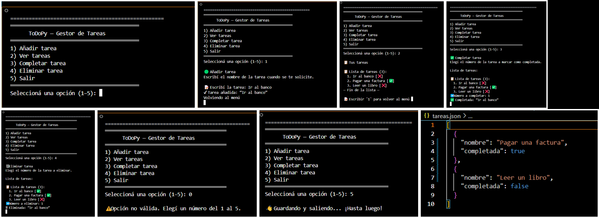

# ToDoPy — Gestor de Tareas por Consola (Python)

Un mini gestor de tareas por **línea de comandos**. Permite **añadir**, **ver**, **completar** y **eliminar** tareas, con **persistencia en JSON**. Ideal como primer proyecto para portafolio.

 <!-- opcional: agregá una captura de la consola -->

---

## 🚀 Características
- Menú simple y claro (ES).
- Tareas con estado: pendiente ✅ / completada ❌.
- Persistencia automática en `tareas.json`.
- Código modular: `app.py` (interfaz) y `funciones.py` (lógica).
- Documentado con docstrings y comentarios.

---

## 📦 Requisitos
- Python 3.8+ (recomendado 3.10+)
- No requiere librerías externas.

---

## 🧰 Instalación
1) Cloná el repo o descargalo como `.zip` y descomprimilo.
2) (Opcional) Creá y activá un entorno virtual.
3) No hay dependencias extra; listo para usar.

```bash
python app.py
```

---

## ▶️ Uso
**Flujo del programa**  
1. `cargar_tareas()` lee `tareas.json` si existe.  
2. Menú por consola:  
   - **(1) Añadir** → pide nombre y guarda.  
   - **(2) Ver** → muestra lista con estado.  
   - **(3) Completar** → pide número y guarda.  
   - **(4) Eliminar** → pide número y guarda.  
   - **(5) Salir** → guarda y cierra.  
3. Después de cada acción que modifica datos se confirma con **“💾 Cambios guardados.”**

**Convenciones UX**  
- Al usuario se le muestran índices **desde 1**; internamente se convierten a base 0.  
- Mensajes claros para evitar errores de uso.

---

## 🗂️ Estructura del proyecto
```
.
├─ app.py           # Bucle del menú y orquestación
├─ funciones.py     # Lógica de tareas y persistencia (JSON)
├─ tareas.json      # (se genera al usar el programa)
├─ README.md
├─ .gitignore
└─ screenshots/
   └─ demo.png      # (opcional) captura de la consola
```

---

## 🤝 Contribuir
Sugerencias y PRs son bienvenidos. Si encontrás un bug, abrí un **issue**.

---

---

## 👤 Autor
**Brian Emanuel Ogas**  
LinkedIn: https://www.linkedin.com/in/brian-emanuel-ogas/
